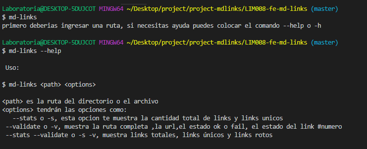
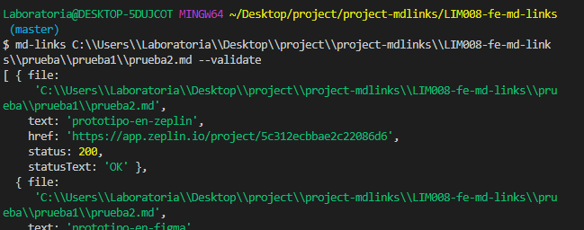
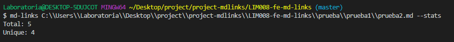
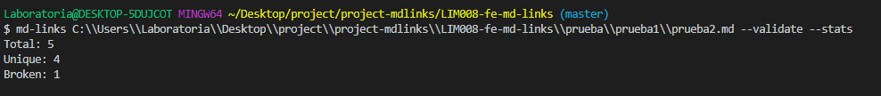
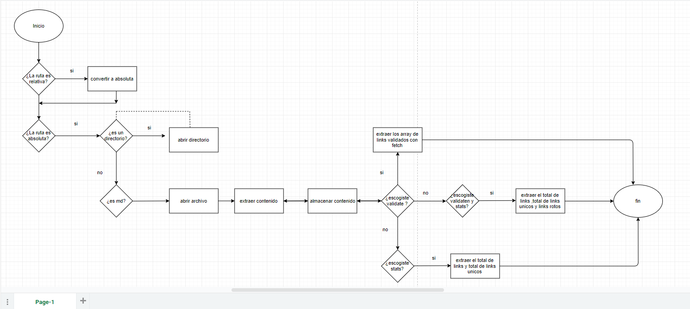
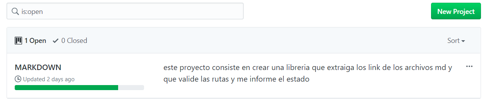

# Markdown Links

## Preámbulo

[Markdown](https://es.wikipedia.org/wiki/Markdown) es un lenguaje de marcado
ligero muy popular entre developers. Es usado en muchísimas plataformas que
manejan texto plano (GitHub, foros, blogs, ...), y es muy común
encontrar varios archivos en ese formato en cualquier tipo de repositorio
(empezando por el tradicional `README.md`).

## pasos para instalar 
primero debes colocar

$ npm install Aurislucero/LIM008-fe-md-links

debes importarlo de la siguiente manera:

const nombre = require('aurislucero-mdlinks');

ofrece la siguiente interfaz:
#### mdLinks(path, options)

Contiene las siguientes opciones:

puedes utilizar el comando --help si quieres saber las opciones que te da la libreria



opcion --validate o -v



opcion --stats  o -s 



opcion --stats --validate




Por ejemplo:

```sh
$ md-links ./some/example.md --validate
./some/example.md http://algo.com/2/3/ ok 200 Link a algo
./some/example.md https://otra-cosa.net/algun-doc.html fail 404 algún doc
./some/example.md http://google.com/ ok 301 Google
```

Vemos que el _output_ en este caso incluye la palabra `ok` o `fail` después de
la URL, así como el status de la respuesta recibida a la petición HTTP a dicha
URL.

##### `--stats`

Si pasamos la opción `--stats` el output (salida) será un texto con estadísticas
básicas sobre los links.

```sh
$ md-links ./some/example.md --stats
Total: 3
Unique: 3
```

También podemos combinar `--stats` y `--validate` para obtener estadísticas que
necesiten de los resultados de la validación.

```sh
$ md-links ./some/example.md --stats --validate
Total: 3
Unique: 3
Broken: 1
```
### Diagrama de flujo



### PROJECT
se uso issues y milestone para dividir tareas y terminar la librería


